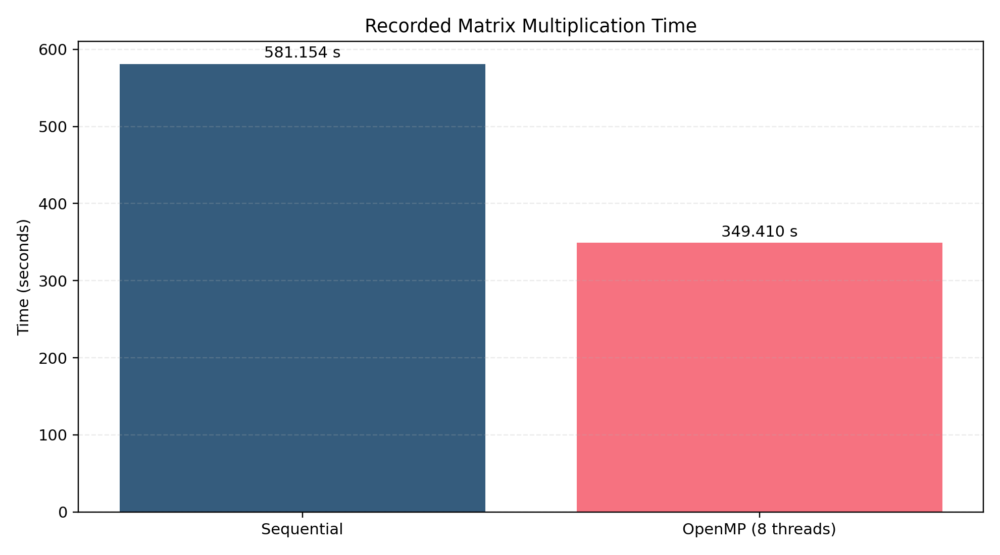
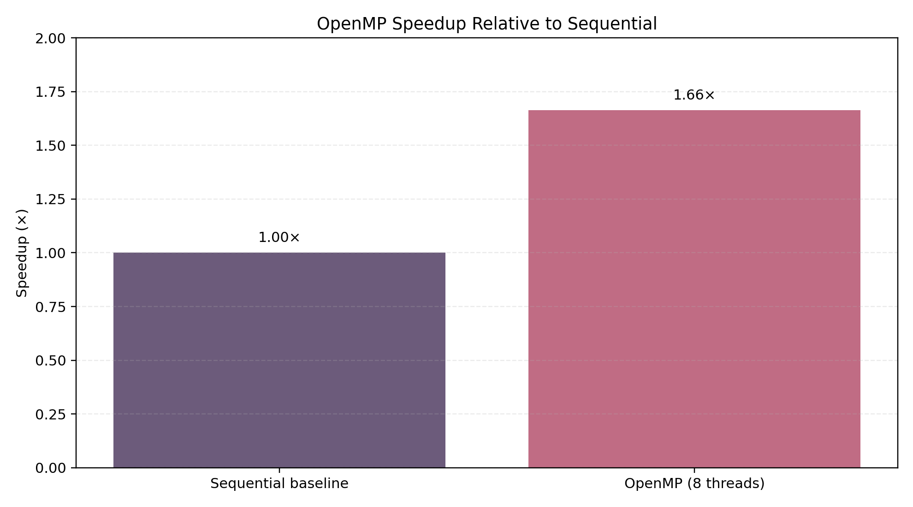

# ⚡ Parallel & GPU Computing Lab
## Matrix Multiplication Across CPU, Multicore and GPU Models

**Sequential → OpenMP → MPI → CUDA**

A practical study of how the same matrix-multiplication workload changes when
it moves from a single CPU process to multicore threads, distributed processes
and GPU threads.

---

## 👤 Author

**Shreya U.**  
Parallel & GPU Computing Laboratory

---

## 🔎 Project Overview

This repository contains four independent implementations of matrix
multiplication.

| Implementation | Execution model | Main idea |
|---|---|---|
| Sequential | Single CPU process | Baseline computation |
| OpenMP | Shared-memory CPU | Parallel CPU threads |
| MPI | Distributed-memory processes | Explicit process communication |
| CUDA | NVIDIA GPU | GPU thread-level parallelism |

The source, evidence and performance material are separated into clear folders
so that every experiment can be inspected independently.

---

## 🧩 Core Problem

For matrices `A` and `B`, every output element is computed as:

```text
C[i][j] = Σ A[i][k] × B[k][j]
```

The arithmetic is the same in all four implementations; what changes is how
the work is mapped onto the available computing resources.

---

## 🗂️ Repository Structure

```text
PGC_Lab_Shreya_U/
│
├── 01_Sequential/
├── 02_OpenMP/
├── 03_MPI/
├── 04_CUDA/
├── 05_Performance_Analysis/
├── assets/
├── evidence/
├── docs/
├── LICENSE
└── README.md
```

---

# 1️⃣ Sequential

The sequential implementation is the reference baseline.

### Build

```bash
cd 01_Sequential
gcc -O2 sequential_matrix.c -o sequential_matrix
```

### Run

```bash
./sequential_matrix
```

### Recorded experiment

```text
Matrix size  : 4000 × 4000
Execution    : Single CPU process
Time         : 581.154139 seconds
Verification : C[0][0] = 4000.00
```

Evidence:

```text
evidence/sequential_execution.png
```

---

# 2️⃣ OpenMP

OpenMP divides the workload among multiple CPU threads in shared memory.

### Build

```bash
cd 02_OpenMP
gcc -O2 -fopenmp matrix_openmp.c -o matrix_openmp
```

### Configure threads

```bash
export OMP_NUM_THREADS=8
echo $OMP_NUM_THREADS
```

### Run

```bash
./matrix_openmp
```

### Recorded experiment

```text
Matrix size  : 4000 × 4000
Threads      : 8
Time         : 349.409567 seconds
Verification : C[0][0] = 4000.00
```

Evidence:

```text
evidence/openmp_execution.png
```

---

# 3️⃣ MPI

MPI uses independent processes and explicit communication.

### Install

```bash
sudo apt update
sudo apt install openmpi-bin libopenmpi-dev -y
```

### Build

```bash
cd 03_MPI
mpicc -O2 matrix_mpi.c -o matrix_mpi
```

### Run

```bash
mpirun -np 4 ./matrix_mpi
```

### Execution model

```text
Rank 0
  │
  ├── Initialize A and B
  │
  ├── Broadcast B
  │
  ├── Scatter rows of A
  │
  ├── Local matrix multiplication
  │
  └── Gather C
          │
          ▼
       Final result
```

The implementation uses `MPI_Bcast`, `MPI_Scatterv` and `MPI_Gatherv` for
communication and row-wise decomposition.

MPI performance should be recorded from the actual execution environment
before being added to the benchmark table.

---

# 4️⃣ CUDA

CUDA maps the output computation onto GPU threads organized into blocks.

The included program uses a **16 × 16 thread block** and measures kernel
execution time using CUDA events.

### Requirement

A working **NVIDIA CUDA-capable GPU** and CUDA Toolkit are required.

### Build

```bash
cd 04_CUDA
nvcc -O2 matrix_cuda.cu -o matrix_cuda
```

### Run

```bash
./matrix_cuda
```

The program reports matrix size, block dimensions, kernel execution time and
result verification.

---

# 📊 Performance Study

## Verified measurements

| Method | Matrix size | Parallel units | Execution time |
|---|---:|---:|---:|
| Sequential | 4000 × 4000 | 1 process | **581.154139 s** |
| OpenMP | 4000 × 4000 | 8 threads | **349.409567 s** |
| MPI | 4000 × 4000 | 4 processes | Pending |
| CUDA | 1024 × 1024 | GPU threads | Pending |

### Execution-time comparison



### OpenMP speedup

```text
Speedup = Sequential time / OpenMP time
        = 581.154139 / 349.409567
        ≈ 1.66×
```



---

# 🧠 Interpretation

For the recorded 4000 × 4000 workload, eight OpenMP threads reduced the
execution time from approximately **581.15 s** to **349.41 s**.

The observed speedup is approximately **1.66×**.

This value is specific to the tested hardware, compiler, workload and thread
configuration. MPI and CUDA results should be entered only after genuine
execution on the corresponding environments.

---

# 🧪 Correctness Verification

For the test matrices initialized with `1.0`:

```text
C[0][0] = 4000.00
```

This gives a simple numerical verification for the 4000 × 4000 case.

---

# 🔬 Model Comparison

| Feature | Sequential | OpenMP | MPI | CUDA |
|---|---|---|---|---|
| CPU execution | ✓ | ✓ | ✓ | — |
| CPU threads | — | ✓ | — | — |
| Multiple processes | — | — | ✓ | — |
| GPU execution | — | — | — | ✓ |
| Shared-memory model | ✓ | ✓ | — | — |
| Explicit communication | — | — | ✓ | — |
| Main strength | Baseline | Multicore CPU | Distributed systems | NVIDIA GPU |

---

# 🎓 Learning Outcomes

- Understand serial and parallel execution.
- Implement shared-memory parallelism using OpenMP.
- Implement process-level parallelism using MPI.
- Understand CUDA threads and blocks.
- Measure execution time.
- Calculate speedup.
- Verify numerical correctness.
- Compare different parallel-computing architectures.

---

# 🏁 Conclusion

The laboratory demonstrates four different ways of executing the same
matrix-multiplication problem.

The sequential version establishes the baseline, OpenMP introduces
multithreaded CPU execution, MPI introduces process-level communication, and
CUDA targets GPU parallelism.

The measured OpenMP experiment demonstrates a clear reduction in execution
time compared with the sequential baseline. MPI and CUDA extend the study to
distributed and GPU-oriented execution environments.

---

## 📁 Evidence & Charts

Terminal evidence is stored under:

```text
evidence/
```

Original visualizations based on the recorded measurements are stored under:

```text
assets/
```

---

## 📜 License

Educational laboratory project by **Shreya U.**
