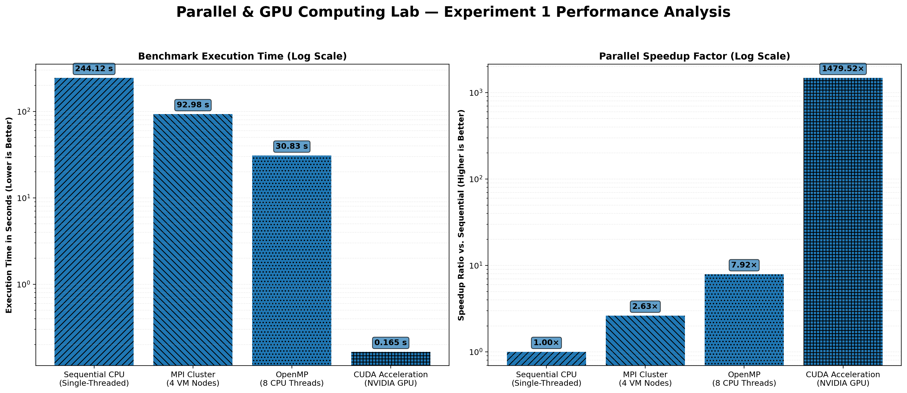
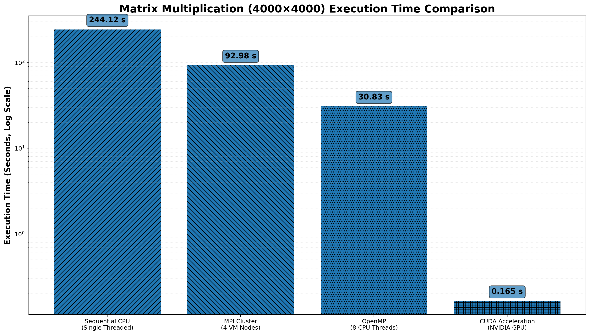
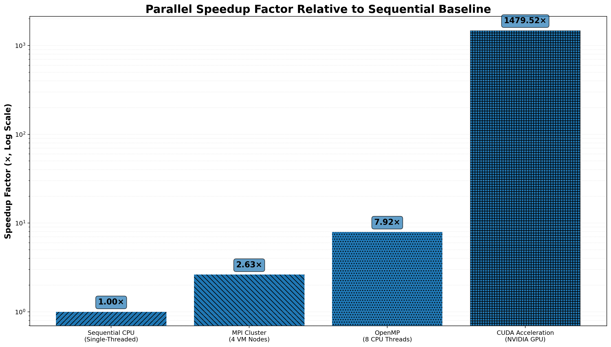

# Parallel-and-GPU-Computing

## Experiments
## Matrix Multiplication using Sequential Processing, OpenMP and MPI

## INTRODUCTION :
This project demonstrates different approaches for performing large-scale matrix multiplication using parallel and distributed computing techniques.

The same matrix multiplication problem is implemented using:

Sequential C programming
OpenMP for shared-memory parallel processing
MPI for distributed-memory processing

The purpose of the project is to understand how parallel and distributed computing can improve the execution of computationally intensive problems.

## AIM:
To implement matrix multiplication using sequential processing, OpenMP and MPI, and study the difference in execution and parallel processing between these approaches.

## PROBLEM STATEMENT :

Matrix multiplication is a computationally intensive operation, especially when the matrix size is large.
For two matrices A and B, the resulting matrix C is calculated as:
C = A × B

- Matrix A: 4000 × 4000
- Matrix B: 4000 × 4000
  
Each element of the result matrix is calculated as:

C[i][j] = Σ A[i][k] × B[k][j]

For this project, matrices of size:
4000 × 4000 are used.

All elements of matrices A and B are initialized to:
1.0

Therefore, every element of the resulting matrix should be:
4000.00

For verification:
C[0][0] = 4000.00

## Overview

This repository presents an empirical performance study of dense matrix multiplication (C = A × B) on a 4000 × 4000 matrix pair, implemented and benchmarked across four distinct computing paradigms:

Sequential — single-core CPU execution (baseline)

OpenMP — shared-memory, multi-threaded CPU execution

MPI — distributed-memory execution across a networked cluster

CUDA — massively parallel GPU execution

The objective is to quantify the performance gains achieved when the same computational workload is migrated from a single CPU core to multi-core, multi-machine, and GPU-based execution environments.

## Objectives

**Multi-model parallelization**— implement a uniform 4000 × 4000 matrix multiplication workload across Sequential, OpenMP, MPI, and CUDA.

**Correctness verification** — use identical matrix initialization (A[i][j] = 1.0, B[i][j] = 1.0) across all implementations so that every result can be checked against the expected value C[0][0] = 4000.00.

**Performance evaluation** — quantify the speedup obtained by moving from single-core execution to shared-memory (OpenMP), distributed-memory (MPI), and SIMT GPU (CUDA) execution.

**Overhead analysis** — examine network communication latency in the MPI cluster and host-to-device / device-to-host memory transfer overhead in CUDA.

## Workload Specification

| **Parameter**            | **Value** |
| ------------------------ | --------- |
| Matrix dimension (N)     | 4000 × 4000 |
| Matrix A                  | `A[i][j] = 1.0` for all i,j |
| Matrix B                  | `B[i][j] = 1.0` for all i,j |
| Operation                 | `C[i][j] = Σ (A[i][k] × B[k][j]), k = 0 to N−1` |
| Expected verification value | `C[0][0] = 4000.00` |

## computing models:

### 1. Sequential Matrix Multiplication

A baseline matrix multiplication implementation using sequential CPU
execution.

[View Sequential Experiment](./Sequential.md)

The sequential version uses three nested loops for matrix multiplication.
The general logic is:

for each row i
    for each column j
        for each k
            C[i][j] = C[i][j] + A[i][k] × B[k][j]

Since there is no parallel processing, the operations are executed sequentially by the CPU.
Compilation
gcc sequential.c -o sequential
Execution
./sequential
Verification

The result is verified using:C[0][0] = 4000.00
The sequential execution time is used as the baseline for comparison with the parallel implementations.

### 2. OpenMP Matrix Multiplication

A shared-memory parallel implementation using OpenMP and multiple CPU
threads.

[View OpenMP Experiment](./OpenMP.md)

OpenMP is used to parallelize the matrix multiplication on the CPU.

The outer loop is parallelized so that different threads can work on different rows of the matrix.
The OpenMP implementation uses:

#pragma omp parallel for


Compilation

gcc -fopenmp openmp.c -o openmp

Set Number of Threads
 to use 8 threads:
export OMP_NUM_THREADS=8

Execute
./openmp

Verify Number of Threads
echo $OMP_NUM_THREADS

Verification
The result should still be:C[0][0] = 4000.00
The main purpose of OpenMP is to reduce the execution time by allowing multiple CPU threads to perform calculations simultaneously.

### 3. MPI Matrix Multiplication

A distributed-memory implementation using MPI across multiple processes and virtual machines.

[View MPI Experiment](./MPI.md) 

MPI is used for distributed-memory parallel processing.
The project uses multiple virtual machines in a Master-Worker configuration.
The general structure is:

             Master
             Rank 0
                |
       ----------|----------
       |         |         |
       ↓         ↓         ↓
    Worker 1  Worker 2  Worker 3
     Rank 1    Rank 2    Rank 3


The MPI implementation demonstrates how a computational problem can be distributed among multiple processes and machines.

### 4. CUDA Matrix Multiplication

A GPU-based implementation using CUDA for parallel matrix multiplication.

[View CUDA Experiment](./CUDA.md)

Matrices A and B are transferred from host to device memory over PCIe. The kernel is launched across a 2D execution grid:

| **Configuration**          | **Value**                    |
| -------------------------- | ---------------------------- |
| Grid                       | 250 × 250 = 62,500 blocks   |
| Block                      | 16 × 16 = 256 threads/block |
| Total logical GPU threads  | 16,000,000                   |

Each thread computes one output cell independently; the result matrix is then copied back to host memory.

## Performance Analysis

The main purpose of the experiment is to observe how execution changes when parallel processing is introduced.

The sequential implementation provides the baseline.

OpenMP uses multiple CPU threads, while MPI distributes work between multiple processes and machines.

## Results:

All four models were executed on the same 4000 × 4000 workload and passed verification (C[0][0] = 4000.00).

| **Model**              | **Execution Time**       | **Speedup vs. Sequential** |
| ---------------------- | ------------------------- | --------------------------- |
| Sequential (1 CPU core) | 244.12 s                  | 1× (baseline)               |
| MPI (4 machines)        | 92.98 s                   | ~2.6×                       |
| OpenMP (8 threads)      | 30.83 s                   | ~7.9×                       |
| CUDA (GPU)              | 0.165 s (0.146 s kernel) | ~1,479.5×                   |

 CUDA additionally achieved a ~186.9× speedup over the OpenMP implementation.


### Visualizations :

| **Chart** | **Preview** |
| --------- | ----------- |
| **Execution time and speedup (combined)** | |

| **Chart** | **Preview** |
| --------- | ----------- |
| **Execution time only** | |

| **Chart** | **Preview** |
| --------- | ----------- |
| **Speedup only** |  |

## Discussion:

**CUDA** delivered the largest performance gain by a wide margin, as it distributes the workload across millions of concurrent GPU threads.

**OpenMP** performed second-best; sharing memory across 8 threads on a single machine introduces minimal overhead.

**MPI** underperformed relative to OpenMP because inter-machine communication over the network (scatter/broadcast/gather) adds real, measurable latency.

**Sequential** execution was the slowest, as the entire workload was processed by a single CPU core with no concurrency.
 
 
## Technologies Used

- C
- GCC
- Ubuntu
- WSL2
- OpenMP
- MPI
- CUDA

## Repository Structure

```text
Parallel-and-GPU-Computing/
│
├── README.md
├── Sequential.md
├── OpenMP.md
├── MPI.md
└── CUDA.md


