<div align="center">

# Parallel Matrix Multiplication

### From one CPU core to a CUDA GPU

**A comparative architecture and performance study**

**Sequential · OpenMP · MPI · CUDA**

**Author: Sai Sri Ram**

| 4,000 × 4,000 workload | Four execution models | Verified output |
|:---:|:---:|:---:|

</div>

## Performance Dashboard

The charts are collected near the top for a quick visual comparison. The execution evidence follows in the requested Sequential, OpenMP, MPI, CUDA order.

The two custom charts use a logarithmic axis so the CPU and GPU measurements remain readable together. Their values come from the benchmark table below; screenshot timings are separate runs.

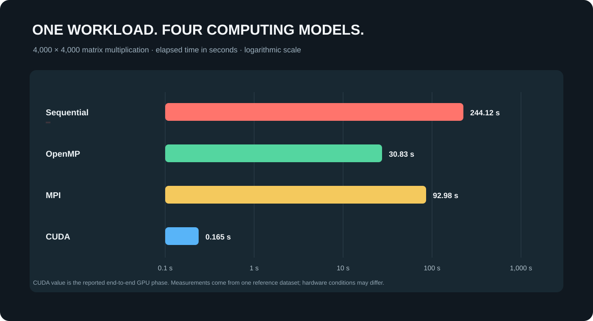

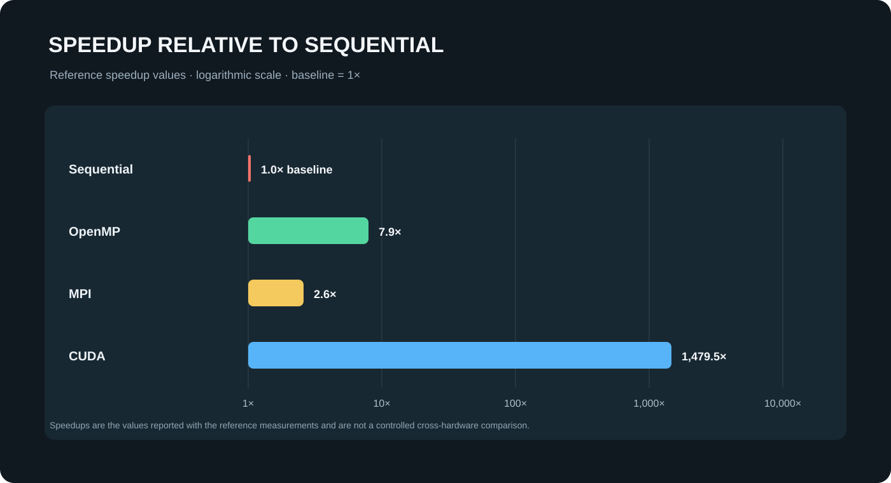

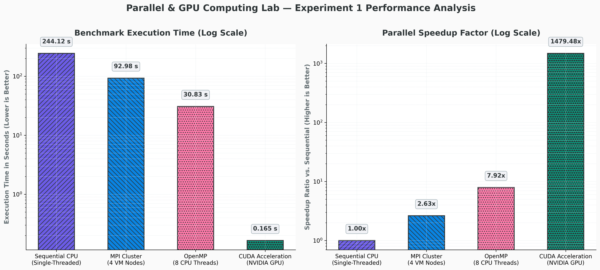

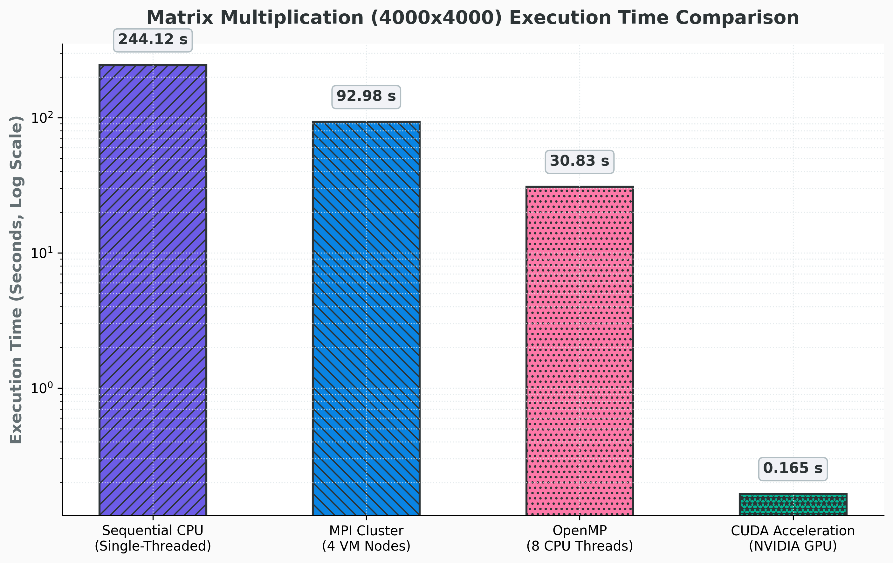


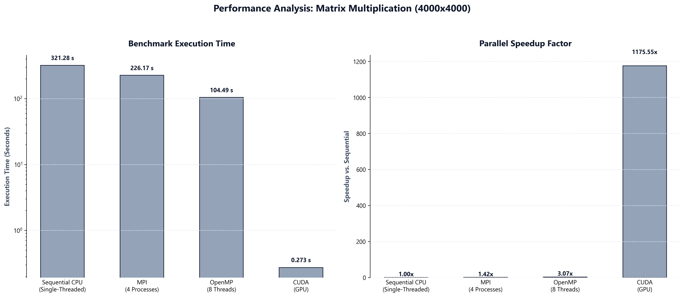

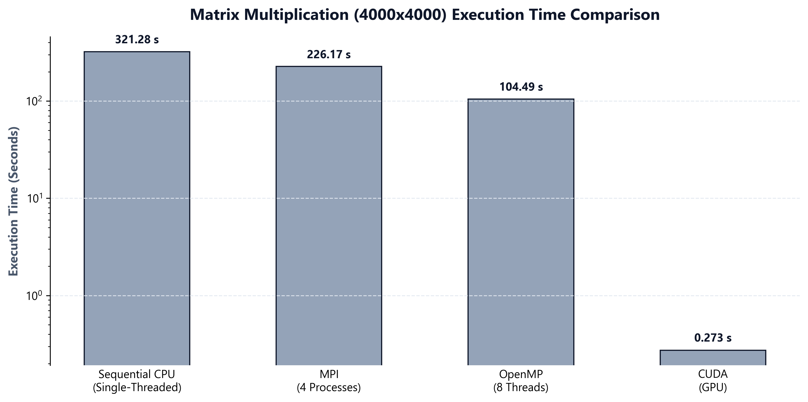

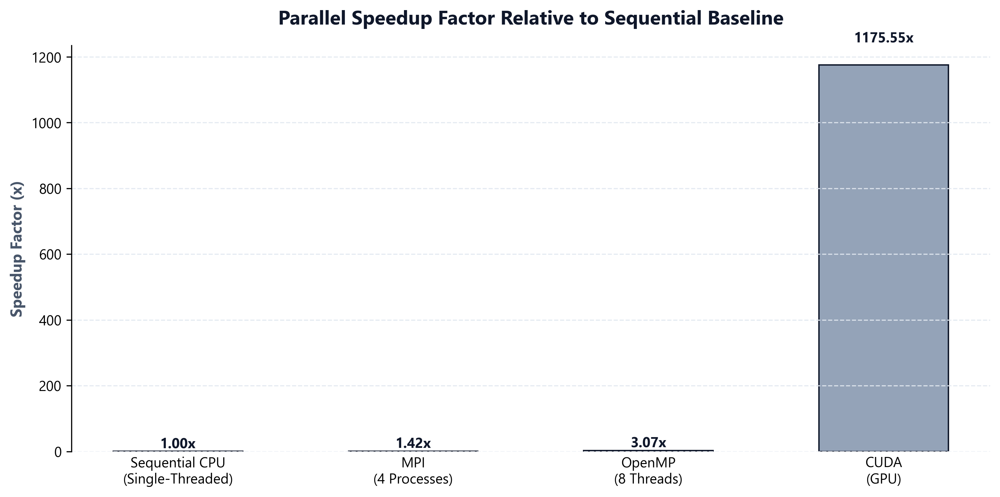

## Project Overview

This project follows one dense matrix multiplication through four computing models: a sequential CPU baseline, shared-memory CPU threads with OpenMP, distributed-memory processes with MPI, and massively parallel GPU threads with CUDA. Each model has a separate source file, architecture diagram, and labeled execution evidence below.

The report is arranged for a quick review: **1. Sequential, 2. OpenMP, 3. MPI, 4. CUDA**. Screenshots are embedded in this README with their `SS` labels beside them, so the essential evidence can be read without opening another page.

## Problem and Correctness

Given square matrices `A` and `B`, compute the product matrix `C`:

```text
C[i][j] = sum(A[i][k] * B[k][j]), for k = 0 ... N-1
```

The programs initialize every input element to `1.0`. Therefore, every result element should equal `N`. At `N = 4000`, the verification value is `C[0][0] = 4000.00`. This shared deterministic check makes it straightforward to compare correctness across all four implementations.

The classical algorithm performs `O(N^3)` arithmetic and uses `O(N^2)` storage. Parallel implementations distribute independent output rows or cells while preserving the same calculation.

## 1. Sequential CPU

The sequential implementation is the single-core baseline. One CPU thread traverses the rows and computes the complete output matrix in sequence. It requires no synchronization or communication between workers.

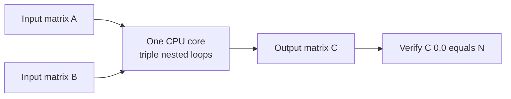

**Architecture:** one CPU core, one execution thread, local host memory.  
**Role in the experiment:** baseline used to verify the result and compare parallel execution.

<table>
  <tr><th align="left">Screenshot label</th><th align="left">Sequential evidence</th></tr>
  <tr><td><strong>SS-1.1 · Sequential execution result</strong><br>Shows the 4,000 × 4,000 run, elapsed time, and result verification.</td><td>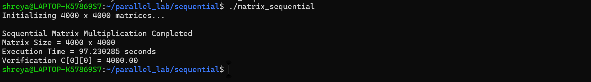</td></tr>
</table>

The included screenshot reports **97.230285 seconds** and verifies `C[0][0] = 4000.00`. Runtime depends on CPU model, compiler, and system load.

## 2. OpenMP Shared-Memory CPU

OpenMP divides independent output rows among CPU worker threads. Threads share the same address space, so they can access the input matrices directly without sending messages or copying data between processes.

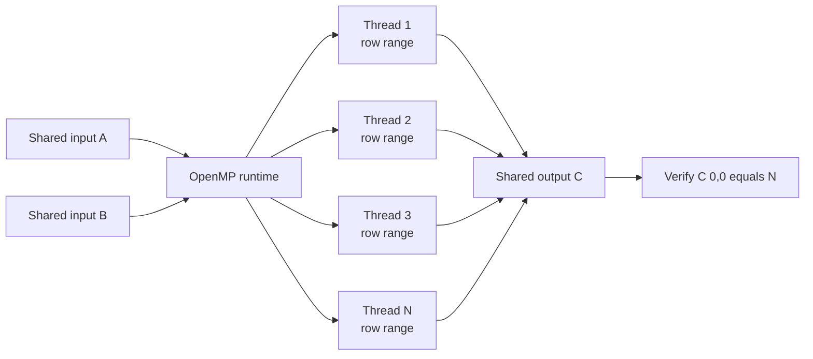

**Architecture:** multiple CPU cores, multiple threads, shared host memory.  
**Work distribution:** each thread calculates a subset of output rows.  
**Local run configuration:** eight OpenMP threads.

<table>
  <tr><th align="left">Screenshot label</th><th align="left">OpenMP evidence</th></tr>
  <tr><td><strong>SS-2.1 · OpenMP execution result</strong><br>Shows eight configured threads, completed matrix multiplication, elapsed time, and verified output.</td><td>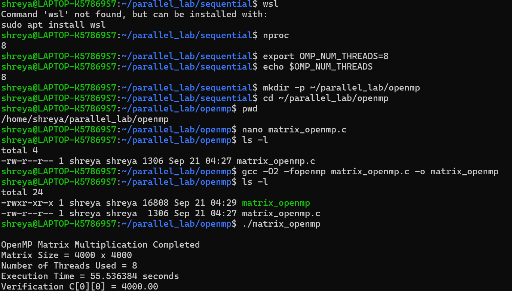</td></tr>
  <tr><td><strong>SS-2.2 · CPU thread activity</strong><br>Shows worker activity during parallel execution.</td><td>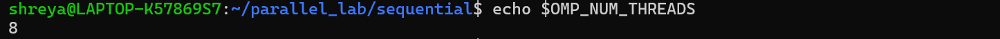</td></tr>
</table>

The included run screenshot reports **55.536384 seconds** using eight threads and verifies `C[0][0] = 4000.00`.

## 3. MPI Distributed-Memory System

MPI assigns row blocks to separate processes. The root process distributes rows of `A` with `MPI_Scatterv`, broadcasts `B` with `MPI_Bcast`, and gathers result rows with `MPI_Gatherv`. Every process owns its own memory; processes can run on one computer or across networked machines.

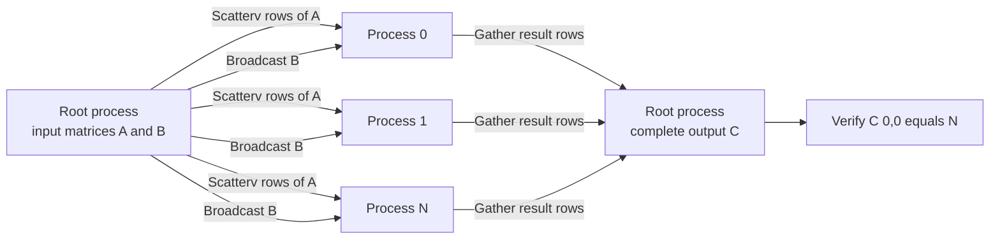

**Architecture:** independent processes with distributed memory.  
**Communication:** scatter input rows, broadcast shared input, gather output rows.  
**Trade-off:** scales across machines, but network communication adds latency and data-transfer overhead.

<table>
  <tr><th align="left">Screenshot label</th><th align="left">MPI evidence</th></tr>
  <tr><td><strong>SS-3.1 · Cluster connectivity</strong><br>Network reachability check for MPI machines.</td><td></td></tr>
  <tr><td><strong>SS-3.2 · Point-to-point message exchange</strong><br>MPI send/receive communication check.</td><td>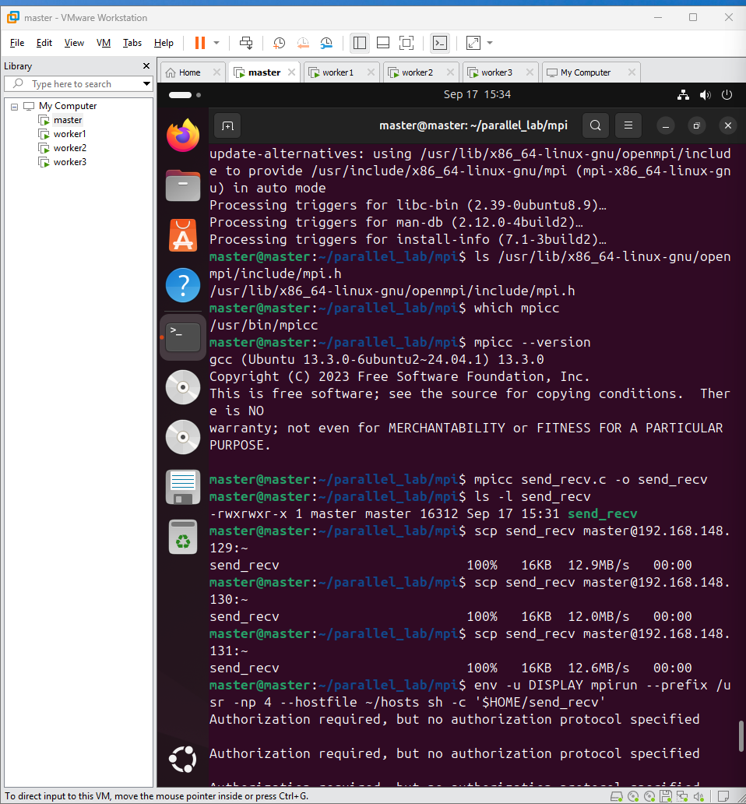</td></tr>
  <tr><td><strong>SS-3.3 · Distributed multiplication result</strong><br>MPI matrix multiplication output.</td><td>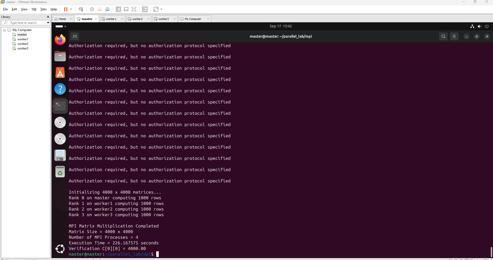</td></tr>
</table>

## 4. CUDA GPU

CUDA maps the output matrix onto a two-dimensional grid of GPU thread blocks. Each thread calculates one output cell. The kernel checks row and column bounds, so it also handles dimensions that are not exact multiples of the block dimensions.

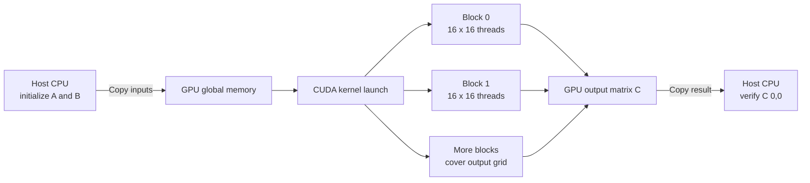

**Architecture:** SIMT execution on an NVIDIA GPU.  
**Work distribution:** one GPU thread computes one output element.  
**Timing:** kernel execution and total GPU phase are measured separately.

<table>
  <tr><th align="left">Screenshot label</th><th align="left">CUDA evidence</th></tr>
  <tr><td><strong>SS-4.1 · CUDA matrix multiplication</strong><br>GPU execution output and correctness evidence.</td><td>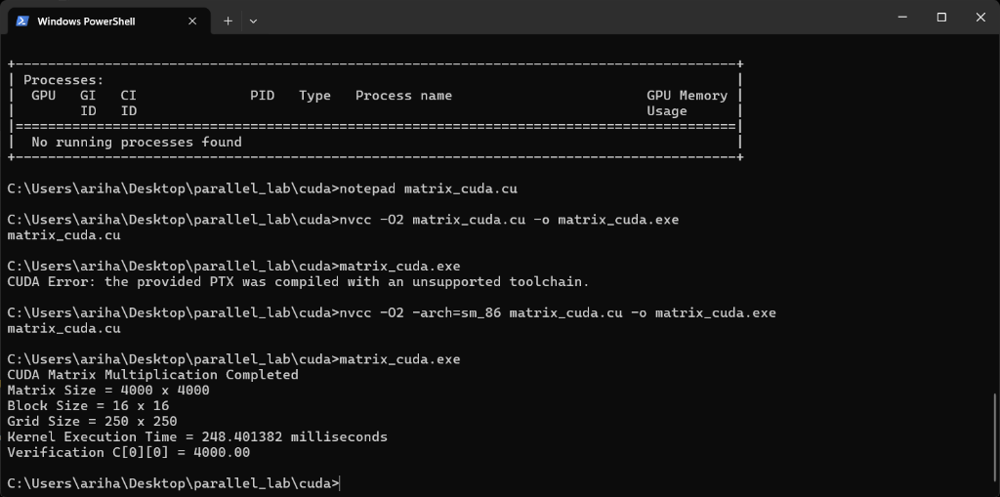</td></tr>
</table>

Three 4,000 × 4,000 single-precision matrices require about **183 MiB** of device memory, plus runtime overhead. The reference GPU result reports **0.146 seconds** for the kernel and **0.165 seconds** for the full GPU phase. Actual performance depends on GPU model, driver, toolkit, and system load.

## Performance Results

The following reference experiment uses the 4,000 × 4,000 workload. Hardware and measurement conditions are not identical across every result, so the cross-model speedups are illustrative rather than a controlled same-machine benchmark.

| Implementation | Reported time | Reported speedup | Context |
|---|---:|---:|---|
| Sequential CPU | 244.12 s | 1.0× | Single-core baseline |
| OpenMP, 8 threads | 30.83 s | 7.9× | Shared-memory CPU |
| MPI, 4 machines | 92.98 s | 2.6× | Distributed-memory run |
| CUDA GPU | 0.165 s total; 0.146 s kernel | 1,479.5× | GPU phase and kernel time are distinct |

The included execution screenshots report separate runtimes: 97.230285 seconds sequential and 55.536384 seconds with eight OpenMP threads. These are different runs and measurement conditions from the benchmark dataset, so they are not mixed into the chart or performance table. The chart values are also available in [`data/benchmark.csv`](data/benchmark.csv).

## Build and Run

Use Ubuntu or WSL2. Install a C compiler for Sequential, OpenMP support for OpenMP, an MPI implementation for MPI, and the NVIDIA CUDA Toolkit plus a compatible NVIDIA GPU/driver for CUDA.

### Sequential

```bash
make sequential
./build/sequential 4000
```

### OpenMP

```bash
make openmp
OMP_NUM_THREADS=8 ./build/openmp 4000
# Or pass the thread count directly:
./build/openmp 4000 8
```

### MPI

```bash
make mpi
mpirun -np 4 ./build/mpi 4000
```

For multi-machine execution, configure host discovery and SSH access for the MPI cluster before launching the program.

### CUDA

```bash
make cuda
./build/cuda 4000
# Optional architecture selection; use the value supported by your GPU:
make cuda CUDA_ARCH=sm_86
```

`make all` builds Sequential and OpenMP. MPI and CUDA are optional targets because their toolchains and hardware are not available on every machine. Use `make clean` to remove generated binaries.

## Development Environment Evidence

This setup screenshot records Ubuntu package installation and a package-index update that failed because DNS could not resolve the Ubuntu package hosts. Retry `sudo apt update` when the environment has network and DNS access.

<table>
  <tr><th align="left">Screenshot label</th><th align="left">Setup evidence</th></tr>
  <tr><td><strong>Setup-1 · Package and network output</strong></td><td>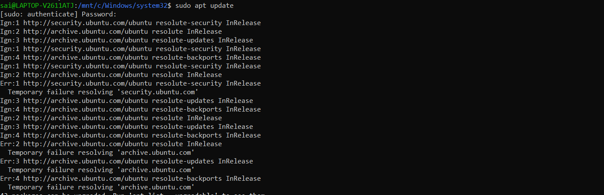</td></tr>
</table>

## Repository Structure

```text
.
|-- README.md
|-- Makefile
|-- .gitignore
|-- docs/
|   |-- sequential.md
|   |-- openmp.md
|   |-- mpi.md
|   `-- cuda.md
|-- images/
|   |-- charts/
|   `-- evidence/
`-- src/
    |-- sequential.c
    |-- openmp.c
    |-- mpi.c
    `-- cuda.cu
```

## Discussion and Limitations

- **Sequential** gives a simple baseline but uses one execution thread for all arithmetic.
- **OpenMP** uses CPU cores efficiently for independent rows while sharing memory bandwidth.
- **MPI** can span machines, but sending and collecting matrix blocks has measurable network cost.
- **CUDA** exposes substantial GPU parallelism; memory capacity and host/device transfers still matter.
- The CUDA kernel here is an educational implementation for understanding thread mapping, not a vendor-tuned GEMM library.
- For a controlled performance study, use the same hardware, record software versions, repeat measurements, and compare medians.

## Screenshot Index

Each screenshot has one label beside it, ordered Sequential, OpenMP, MPI, and CUDA. All 16 charts and screenshots are stored in the repository; all eight charts appear first in this README, followed by the uniquely labeled execution evidence. See the [image manifest](images/README.md) for a file checklist.

## License

No license is included. Add one after deciding how this project should be reused.
